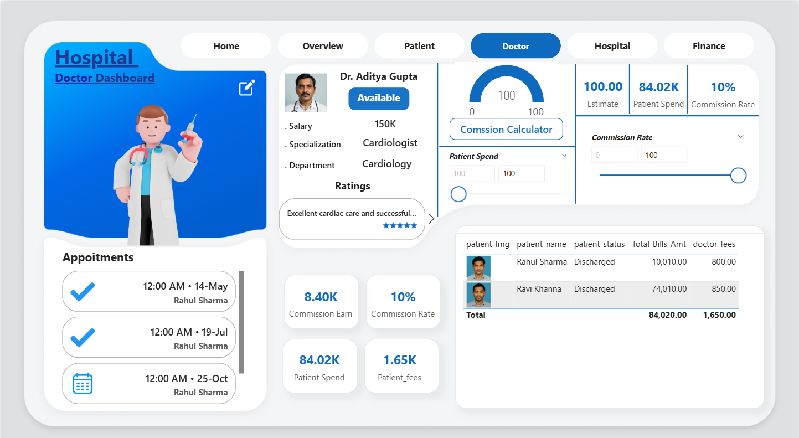
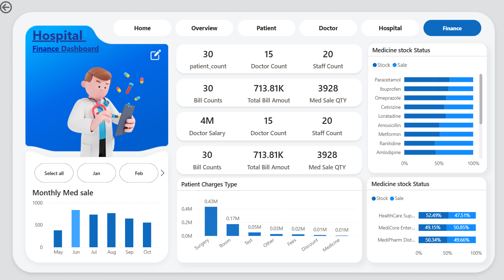
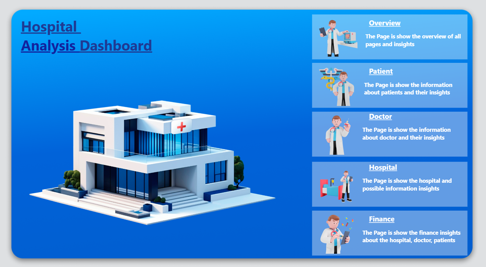
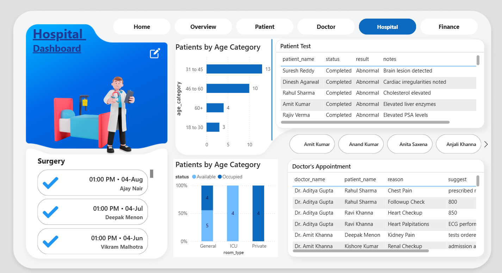
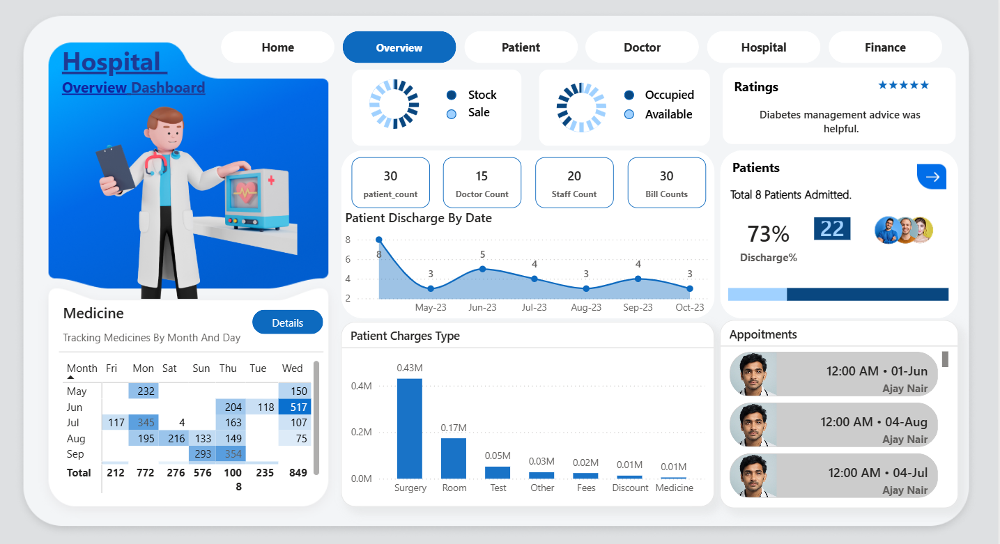
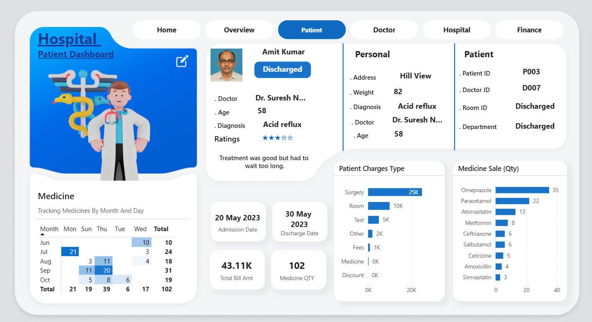

# Hospital Management Dashboard

A comprehensive web-based hospital management system featuring multiple specialized dashboards for healthcare administration, patient management, and financial tracking.

## Overview

This hospital management dashboard provides a complete solution for healthcare facilities to manage their operations efficiently. The system includes dedicated interfaces for different stakeholders including doctors, administrators, and finance teams.

## Screenshots

### Doctor Dashboard

*Doctor-specific interface showing appointment management, patient information, commission tracking, and earnings overview with integrated rating system.*

### Finance Dashboard  

*Comprehensive financial management interface displaying revenue analytics, medicine inventory status, monthly sales trends, and patient billing categorization.*

### Hospital Analysis Dashboard

*Central navigation hub providing access to all system modules with detailed descriptions of Overview, Patient, Doctor, Hospital, and Finance sections.*

### Hospital Management Dashboard

*Hospital operations interface featuring patient demographics by age, surgery scheduling, test results tracking, and doctor appointment management.*

### Overview Dashboard

*System-wide analytics dashboard showing key metrics including patient counts, staff statistics, discharge trends, medicine tracking, and appointment scheduling.*

### Patient Dashboard

*Individual patient management interface displaying personal information, medical history, treatment records, billing details, and medication tracking.*
---
## Features

### 🏥 Multi-Dashboard Architecture
- **Doctor Dashboard** - Patient appointments, commission tracking, and earnings overview
- **Finance Dashboard** - Revenue analytics, medicine inventory, and billing management  
- **Hospital Dashboard** - Patient demographics, surgery schedules, and test results
- **Patient Dashboard** - Individual patient records, treatment history, and medication tracking
- **Overview Dashboard** - System-wide metrics and key performance indicators
---
### 📊 Key Functionalities

#### Doctor Management
- Doctor profiles with specialization tracking
- Appointment scheduling and management
- Commission calculation and payment tracking
- Patient rating and feedback system
- Availability status management

#### Financial Management
- Revenue tracking and analytics
- Medicine inventory management with stock levels
- Patient billing and charge categorization
- Monthly sales reporting
- Commission and salary calculations

#### Patient Management
- Comprehensive patient records
- Age-based patient categorization
- Test results and medical history tracking
- Admission and discharge management
- Treatment progress monitoring

#### Analytics & Reporting
- Patient discharge trends
- Revenue analytics by service type
- Medicine sales tracking
- Staff performance metrics
- Real-time dashboard updates
---
## Technical Specifications

### Dashboard Components
- **Responsive Design** - Optimized for desktop and mobile devices
- **Interactive Charts** - Data visualization using modern charting libraries
- **Real-time Updates** - Live data synchronization across all modules
- **User Authentication** - Role-based access control for different user types
---
### Data Management
- Patient demographic analysis
- Financial transaction tracking
- Inventory management system
- Appointment scheduling system
- Medical record management
---
## Installation

```bash
# Clone the repository
git clone https://github.com/yourusername/hospital-dashboard.git

# Navigate to project directory
cd hospital-dashboard

# Install dependencies
npm install

# Start the development server
npm start
```

## Usage

### Getting Started
1. Access the dashboard through your web browser
2. Login with your assigned credentials
3. Navigate between different dashboard sections using the top navigation
4. Use the role-specific features based on your access level
---
### Dashboard Navigation
- **Home** - Main landing page with overview metrics
- **Overview** - System-wide analytics and insights
- **Patient** - Patient management and records
- **Doctor** - Doctor profiles and scheduling
- **Hospital** - Facility management and operations
- **Finance** - Financial tracking and reporting
---
### Version 1.0.0
- Initial release with core dashboard functionality
- Doctor, Patient, Finance, and Hospital management modules
- Real-time analytics and reporting features
- Responsive design implementation

---

## Developer

**Sushant**

Data Analytics / Buisness Analysis Developer specializing in Power BI dashboard development and MySQL database management for healthcare analytics solutions.

### Connect with me:
- **LinkedIn**: http://linkedin.com/in/sushant-556728201
- **Email**: sushant171020@gmail.com
- **Alternative Email**: chauhansushant2002@gmail.com

Feel free to reach out for collaboration opportunities, project discussions, or any questions about this hospital management system.

---

**Note**: This system is designed for healthcare management purposes. Ensure compliance with healthcare data regulations (HIPAA, GDPR, etc.) when deploying in production environments.
